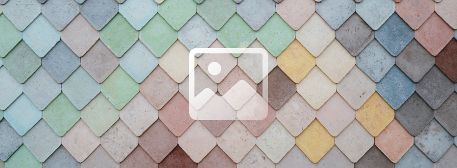

# Flippy

⚠️⚠️⚠️ Flippy is not longer developed, all development has moved to [pixie](https://github.com/treeform/pixie). ⚠️⚠️⚠️



Flippy is a simple 2d image and drawing library.

Basic usage:

```nim
import flippy, vmath, chroma

# load an image
var image = loadImage("tests/lenna.png")
# print it out
echo image
# get a color pixel
echo image.getRgba(100, 100)
# put a color pixel
image.putRgba(10, 10, rgba(255, 0, 0, 255))
# blit a rectangular part from one place to another
blit(image, image, rect(0, 0, 100, 100), rect(100, 100, 100, 100))
# draw a line
image.line(vec2(11, 11), vec2(100, 100), rgba(0, 0, 0, 255))
# minify image by 2 or 1/2 or scale by 50%
image = image.minify(2)
# save the image to a file
image.save("tests/lenna2.png")
```


# API: flippy

```nim
import flippy
```

## **type** Image

Main image object that holds the bitmap data.

```nim
Image = ref object
 filePath*: string
 width*, height*, channels*, format*: int
 data*: seq[uint8]
```

## **type** Flippy


```nim
Flippy = object
 mipmaps*: seq[Image]
```

## **proc** `$`

Display the image path, size and channels.

```nim
proc `$`(image: Image): string
```

## **proc** newImage

Creates a new image with appropriate dimensions.

```nim
proc newImage(width, height, channels: int): Image
```

## **proc** newImage

Creates a new image with a path.

```nim
proc newImage(filePath: string; width, height, channels: int): Image
```

## **proc** loadImage

Loads a png image.

```nim
proc loadImage(filePath: string): Image {.raises: [IOError], tags: [ReadIOEffect, RootEffect, WriteIOEffect].}
```

## **proc** copy

Copies an image creating a new image.

```nim
proc copy(image: Image): Image
```

## **proc** save

Saves a png image.

```nim
proc save(image: Image) {.raises: [IOError], tags: [WriteIOEffect, RootEffect].}
```

## **proc** save

Sets image path and save the image.

```nim
proc save(image: Image; filePath: string) {.raises: [IOError], tags: [WriteIOEffect, RootEffect].}
```

## **proc** inside

Returns true if (x, y) is inside the image.

```nim
proc inside(image: Image; x, y: int): bool {.inline.}
```

## **proc** getRgbaUnsafe

Gets a color from (x, y) coordinates.
 * No bounds checking *

<p>Make sure that x, y are in bounds. Failure in the assumptions will case unsafe memory reads.</p>

```nim
proc getRgbaUnsafe(image: Image; x, y: int): ColorRGBA {.inline.}
```

## **proc** getRgbaUnsafe

Gets a pixel as (x, y) floats.
 * No bounds checking *

<p>Make sure that x, y are in bounds. Failure in the assumptions will case unsafe memory reads.</p>

```nim
proc getRgbaUnsafe(image: Image; x, y: float64): ColorRGBA {.inline.}
```

## **proc** getRgba

Gets a pixel at (x, y) or returns transparent black if outside of bounds. Slower due to bounds checking.

```nim
proc getRgba(image: Image; x, y: int): ColorRGBA {.inline.}
```

## **proc** getRgbaSmooth

Gets a pixel as (x, y) floats.

```nim
proc getRgbaSmooth(image: Image; x, y: float64): ColorRGBA {.inline.}
```

## **proc** putRgbaUnsafe

Puts a ColorRGBA pixel back.
 * No bounds checking *

<p>Make sure that x, y are in bounds. Failure in the assumptions will case unsafe memory writes.</p>

```nim
proc putRgbaUnsafe(image: Image; x, y: int; rgba: ColorRGBA) {.inline.}
```

## **proc** putRgbaUnsafe

Puts a ColorRGBA pixel back as x, y floats (does not do blending).
 * No bounds checking *

<p>Make sure that x, y are in bounds. Failure in the assumptions will case unsafe memory writes.</p>

```nim
proc putRgbaUnsafe(image: Image; x, y: float64; rgba: ColorRGBA) {.inline, tags: [].}
```

## **proc** putRgba

Puts pixel onto the image or safely ignored if pixel is outside the image. Slower due to bounds checking.

```nim
proc putRgba(image: Image; x, y: int; rgba: ColorRGBA) {.inline.}
```

## **proc** minifyBy2

Scales the image down by an integer scale.

```nim
proc minifyBy2(image: Image): Image
```

## **proc** minify

Scales the image down by an integer scale.

```nim
proc minify(image: Image; scale: int): Image
```

## **proc** magnify

Scales image image up by an integer scale.

```nim
proc magnify(image: Image; scale: int): Image
```

## **proc** blitUnsafe

Blits rectangle from one image to the other image.
 * No bounds checking *

<p>Make sure that src and dest rect are in bounds. Make sure that channels for images are the same. Failure in the assumptions will case unsafe memory writes.</p>

```nim
proc blitUnsafe(destImage: Image; srcImage: Image; src, dest: Rect)
```

## **proc** blit

Blits rectangle from one image to the other image.

```nim
proc blit(destImage: Image; srcImage: Image; src, dest: Rect)
```

## **proc** blit

Blits rectangle from one image to the other image.

```nim
proc blit(destImage: Image; srcImage: Image; pos: Vec2)
```

## **proc** blitWithAlpha

Blits rectangle from one image to the other image.

```nim
proc blitWithAlpha(destImage: Image; srcImage: Image; src, dest: Rect)
```

## **proc** blitWithMask

Blits rectangle from one image to the other image with masking color.

```nim
proc blitWithMask(destImage: Image; srcImage: Image; src, dest: Rect; rgba: ColorRGBA)
```

## **proc** getSubImage

Gets a sub image of the main image.

```nim
proc getSubImage(image: Image; x, y, w, h: int): Image
```

## **proc** trim

Trims the transparent (alpha=0) border around the image.

```nim
proc trim(image: Image): Image
```

## **proc** flipHorizontal

Flips the image around the Y axis.

```nim
proc flipHorizontal(image: Image): Image
```

## **proc** flipVertical

Flips the image around the X axis.

```nim
proc flipVertical(image: Image): Image
```

## **proc** blit

Blits one image onto another using matrix with alpha blending.

```nim
proc blit(destImage, srcImage: Image; mat: Mat4)
```

## **proc** blitWithAlpha

Blits one image onto another using matrix with alpha blending.

```nim
proc blitWithAlpha(destImage: Image; srcImage: Image; mat: Mat4)
```

## **proc** fill

Fills the image with a solid color.

```nim
proc fill(image: Image; rgba: ColorRGBA)
```

## **proc** line

Draws a line from one at vec to to vec.

```nim
proc line(image: Image; at, to: Vec2; rgba: ColorRGBA)
```

## **proc** fillRect

Draws a filled rectangle.

```nim
proc fillRect(image: Image; rect: Rect; rgba: ColorRGBA)
```

## **proc** strokeRect

Draws a rectangle borders only.

```nim
proc strokeRect(image: Image; rect: Rect; rgba: ColorRGBA)
```

## **proc** fillCircle

Draws a filled circle with antialiased edges.

```nim
proc fillCircle(image: Image; pos: Vec2; radius: float; rgba: ColorRGBA)
```

## **proc** strokeCircle

Draws a border of circle with antialiased edges.

```nim
proc strokeCircle(image: Image; pos: Vec2; radius, border: float; rgba: ColorRGBA)
```

## **proc** fillRoundedRect

Fills image with a rounded rectangle.

```nim
proc fillRoundedRect(image: Image; rect: Rect; radius: float; rgba: ColorRGBA)
```

## **proc** strokeRoundedRect

Fills image with a stroked rounded rectangle.

```nim
proc strokeRoundedRect(image: Image; rect: Rect; radius, border: float; rgba: ColorRGBA)
```

## **proc** ninePatch

Draws a 9-patch

```nim
proc ninePatch(image: Image; rect: Rect; radius, border: float; fill, stroke: ColorRGBA)
```

## **proc** rotate90Degrees

Rotates the image clockwise.

```nim
proc rotate90Degrees(image: Image): Image
```

## **proc** rotateNeg90Degrees

Rotates the image anti-clockwise.

```nim
proc rotateNeg90Degrees(image: Image): Image
```

## **proc** shearX

Shears the image horizontally; resizes to fit.

```nim
proc shearX(image: Image; shear: float): Image
```

## **proc** shearY

Shears the image vertically; resizes to fit.

```nim
proc shearY(image: Image; shear: float): Image
```

## **proc** rotate

Rotates the image by given angle (in degrees) using the 3-shear method (Paeth method)

```nim
proc rotate(image: Image; angle: float): Image
```

## **proc** removeAlpha

Removes alpha channel from the images by: Setting it to 255 everywhere.

```nim
proc removeAlpha(image: Image)
```

## **proc** alphaBleed

PNG saves space by encoding alpha = 0 areas as black however scaling such images lets the black or gray come out. This bleeds the real colors into invisible space.

```nim
proc alphaBleed(image: Image)
```

## **proc** blur

Blurs the image by x and y directions.

```nim
proc blur(image: Image; xBlur: int; yBlur: int): Image
```

## **proc** resize


```nim
proc resize(srcImage: Image; width, height: int): Image
```

## **proc** outlineBorder

Adds n pixel border around alpha parts of the image.

```nim
proc outlineBorder(image: Image; borderPx: int): Image
```

## **func** width


```nim
func width(flippy: Flippy): int
```

## **func** height


```nim
func height(flippy: Flippy): int
```

## **proc** save

Flippy is a special file format that is fast to load and save with mip maps.

```nim
proc save(flippy: Flippy; filePath: string) {.raises: [Exception, IOError, OSError, SnappyException], tags: [WriteIOEffect].}
```

## **proc** pngToFlippy


```nim
proc pngToFlippy(pngPath, flippyPath: string) {.raises: [IOError, Exception, OSError, SnappyException], tags: [ReadIOEffect, RootEffect, WriteIOEffect].}
```

## **proc** loadFlippy

Flippy is a special file format that is fast to load and save with mip maps.

```nim
proc loadFlippy(filePath: string): Flippy {.raises: [Exception, IOError, OSError, ValueError, SnappyException], tags: [WriteIOEffect, ReadIOEffect].}
```
